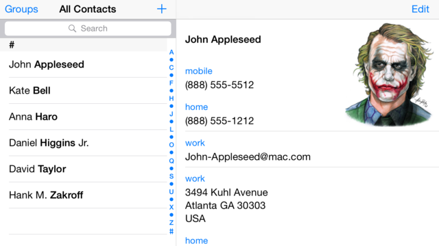

# Contato - Agenda 1


O objetivo dessa atividade é implementar uma classe responsável por guardar um único contato da agenda telefônica do seu celular.
Cada contato pode ter vários telefones.


- [Requisitos](#requisitos)
- [Diagrama](#diagrama)
- [Exemplo de execução](#exemplo-de-execução)
- [Relatório de Entrega](#relatório-de-entrega)


## Requisitos

- Inicializar
  - Para inicializar um contato você precisar informar o nome do contato.
- Inserir fones no contato
  - Um fone tem um indentificador e um número
  - Identificadores são nomes como: casa, fixo, oi, claro.
- Remover fones do contato
  - Remover os fones pelo indíce.
  - Se o indíce informado não for válido, não vai ser possíve remover.
- Validar números de telefone
  - Processe os números de telefone para que sejem aceitos somente aqueles que tem os seguintes caracteres: ```0123456789()-```.
  - Se o usuário tentar inserir um número de telefone inválido não adcione o fone no contato.

## Diagrama

## Exemplo de execução 
```java
public class Runner {

    public static void main(final String[] args) {
        
        Contato contato = new Contato("Alex");
        System.out.println(contato);
        //  - Alex

        contato.adicionarFone(new Fone("Claro", "(77)89085-9077"));
        contato.adicionarFone(new Fone("Tim", "(63)61730-9301"));
        contato.adicionarFone(new Fone("Vivo", "(83)13265-4910"));
        System.out.println(contato);
        //  - Alex [0:Claro:(77)89085-9077] [1:Tim:(63)61730-9301] [2:Vivo:(83)13265-4910]

        if(!contato.adicionarFone(new Fone("Oi", "(44)40674-308[4]"))){
            System.out.println("fail: numero infomador é inválido");
        }// fail: numero infomador é inválido

        if(!contato.adicionarFone(new Fone("Claro", "(33)40674-num"))){
            System.out.println("fail: numero infomador é inválido");
        }// fail: numero infomador é inválido

        contato.adicionarFone(new Fone("Casa", "(39)11322-7246"));
        System.out.println(contato);
        //  - Alex [0:Claro:(77)89085-9077] [1:Tim:(63)61730-9301] [2:Vivo:(83)13265-4910] [3:Casa:(39)11322-7246]

        contato.removerFone(1);
        contato.removerFone(2);
        System.out.println(contato);
        // - Alex [0:Claro:(77)89085-9077] [1:Vivo:(83)13265-4910]

        if(!contato.removerFone(3)){
            System.out.println("fail: index infomado não não existe.");
        }// fail: index infomado não não existe.

        if(contato.removerFone(-2)){
            System.out.println("fail: index infomado não não existe.");
        }// fail: index infomado não não existe.
        System.out.println(contato);
        // - Alex [0:Claro:(77)89085-9077] [1:Vivo:(83)13265-4910]
    }
}
```

## Relatório de Entrega

Não esqueça de preencher o seguinte formulário [Link para formulário](#form) ao completar a atividade.
